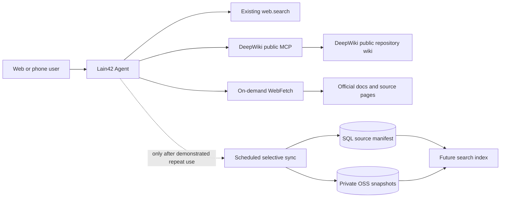

# Architecture Recommendation: DeepWiki knowledge sources

## Problem

The Lain42 Agent should answer repository and research questions from current, attributable web sources. The decision is whether to fetch sources on demand, connect DeepWiki's public repository interface, or periodically mirror DeepWiki pages into OSS and operate a persistent knowledge base.

## Constraints and Quality Attributes

- The user prefers WebFetch-style source reading and wants phone/browser access as well as desktop access.
- The user also requests a user-pinned knowledge base with one personal space, 5 GB for standard accounts and 20 GB for members.
- The Agent already has `web.search` for bounded Bing RSS or configured SearXNG results, but it has no general page-fetch endpoint. MCP tools can be connected in Tauri; paired browsers can use connected tools.
- The official DeepWiki MCP is a remote, no-auth service for public repositories. It offers `read_wiki_structure`, `read_wiki_contents`, and `ask_question`; private repositories require a Devin account MCP connection.
- The service has a DB-backed scheduled-task framework, but `TaskArtifactStore` S3 settings are a disabled placeholder and always fall back to upstream mode. Neither is a ready-made knowledge-base sync pipeline.
- No explicit official permission to bulk mirror or redistribute DeepWiki-generated pages was found. Treat archival/redistribution rights as unresolved.

## Options

1. **On-demand sources**: fetch a requested page or query DeepWiki when the user asks. Keep results and source URLs in the current run only.
2. **Nightly bulk mirror**: crawl a broad DeepWiki corpus into OSS and build a searchable index.
3. **User-pinned knowledge space**: one per-user space; snapshot only explicitly pinned pages or public repositories into private OSS, with per-tier storage quotas and source revision metadata.

## Diagram

## Tradeoff Comparison

| Option | Freshness and attribution | Operating cost | Security and rights | Fit now |
| --- | --- | --- | --- | --- |
| On-demand WebFetch + DeepWiki MCP | Current content with source links; no mirror drift | Low | Fetch must enforce SSRF, byte/time limits, and untrusted-content handling | Best first step |
| Nightly bulk mirror | Often stale between runs; hard to track source revisions | High and grows with corpus | Largest copyright/terms, prompt-injection, deletion, and retention surface | Reject for now |
| User-pinned knowledge space | Versioned, attributable snapshots for explicitly selected sources | Bounded by user quota: 5 GB standard / 20 GB member | Requires private per-user object keys, atomic quota accounting, purge, and license/terms review | Recommended after the WebFetch path is stable |

## Recommendation

1. Use on-demand WebFetch as the general source-reading path. For public GitHub repositories, offer the official DeepWiki MCP endpoint `https://mcp.deepwiki.com/mcp` as a one-click optional connection because it provides structured wiki outline, content, and grounded Q&A.
2. Keep fetched text request-scoped initially. Preserve the canonical URL, retrieval time, and repository/ref context in the tool result; treat fetched text as untrusted data, never as agent instructions.
3. Do not add a periodic DeepWiki crawler or OSS corpus mirror. OSS is object storage, not the retrieval index, and the current S3 artifact-store setting is not implemented.
4. After WebFetch is stable, add one user-pinned knowledge space. Apply the requested 5 GB standard / 20 GB member logical-content quota server-side; never trust a tier or byte count from the client. Pinning is an explicit action and only selected public pages/repositories are eligible for scheduled refresh.
5. Store snapshots in private per-user OSS prefixes; use a SQL manifest with source URL, owner/repo, commit/ref when available, fetched time, ETag/content hash, object key, current logical bytes, license/terms review, and retention state. Reserve quota transactionally before upload, roll it back on failure, de-duplicate by hash, and purge replaced objects. Build a separate index only after keyword retrieval is inadequate.
6. Do not send private repositories to the public DeepWiki MCP. Use the user's authorized GitHub/CLI path or a separately authorized private connector.

## Transition Plan

- Phase 1 (implemented locally, not yet deployed): WebFetch on the authenticated server API for browser/mobile access; HTTP(S)-only, default ports, public-address DNS pinning, redirect revalidation, strict response byte/time limits and textual MIME filtering. Add a one-click public DeepWiki Streamable HTTP preset to the desktop MCP connector. Current tests cover private/reserved address rejection, redirect-to-private, HTTPS downgrade, response text cleanup, and bounded limits.
- Phase 2: implement one pinned knowledge space per user, membership-derived quota (5 GB / 20 GB), private OSS object storage and SQL manifest. Test concurrent quota reservations, retries, deletion, deduplication, and member downgrades.
- Phase 3: enable opt-in scheduled refresh only for explicitly pinned sources, subject to source rights and retention policy; keep scheduler, OSS adapter, manifest, and retrieval index behind separate interfaces.

## Risks

- DeepWiki MCP availability, coverage, and freshness are controlled by the upstream service; it is not an archival guarantee.
- WebFetch creates an SSRF and indirect prompt-injection surface. A model-provided URL must not be trusted merely because it is a valid URL.
- OSS versioning can increase storage cost; Alibaba Cloud documents charging for historical versions and recommends lifecycle rules for cleanup.
- A cached/generated wiki can become stale or outlive the source repository's license or deletion state unless the manifest records provenance and supports purge.

## Assumptions

- The first knowledge source is public repositories and public web documentation.
- Avoiding stale answers, reducing implementation effort, and preserving user/phone access are more valuable initially than offline knowledge-base availability.
- OSS bucket access, a dedicated RAM identity, egress domain, and retention policy for this feature have not been verified in this repository.

## Validation Steps

- Connect to the official DeepWiki endpoint without credentials and read a known public repository's structure/content.
- Confirm that only public repository identifiers and questions are sent to the public service, and that the website does not imply private-repository support.
- Confirm the paired phone receives actual MCP results only while its selected desktop/Radxa device is online; otherwise show a clear unavailable state.
- Before deploying WebFetch, add integration tests for DNS rebinding/pinned dialing, oversized compressed responses, unsupported media types, slow responses, and hostile page instructions; current unit tests cover core address and redirect rules.
- For any future scheduled sync, demonstrate idempotent unchanged-source skips, bounded concurrency, retention/purge, and per-repository rights review before enabling the worker.

## References

- [DeepWiki MCP documentation](https://docs.devin.ai/work-with-devin/deepwiki-mcp)
- [DeepWiki repository wiki documentation](https://docs.devin.ai/work-with-devin/deepwiki)
- [OWASP SSRF Prevention Cheat Sheet](https://cheatsheetseries.owasp.org/cheatsheets/Server_Side_Request_Forgery_Prevention_Cheat_Sheet.html)
- [Alibaba Cloud OSS S3 compatibility](https://help.aliyun.com/zh/oss/developer-reference/compatibility-with-amazon-s3)
