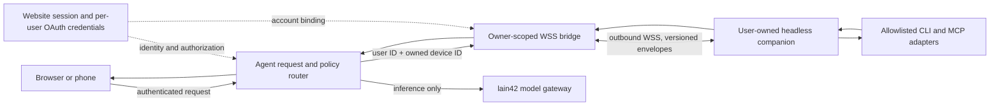

# Architecture Review: Owner-Scoped Headless Agent Devices

**Status:** Proposed; implementation underway
**Scope:** Browser/mobile Agent sessions, user-linked credentials, and headless CLI/MCP companions
**Last reviewed:** 2026-09-24

## Problem and constraints

The Agent must work from browsers and phones while CLI and MCP tools execute on a user's own machine. That machine is a private, user-owned resource. Haoyu's Radxa A7A is not a service-wide worker and must never be silently selected for other accounts. The existing companion makes an outbound WSS connection, which works behind NAT without opening SSH or other inbound ports.

The architecture must preserve account isolation, support multiple independently paired nodes per account, keep credentials out of model context, allow revocation, and let future clients implement a versioned protocol. Server builds and tests are verified by GitHub Actions; no local device is part of the shared test environment.

## Options

| Option | Benefits | Costs and risks | Decision |
| --- | --- | --- | --- |
| Website initiates SSH to each user's machine | Familiar remote shell; broad system access | Requires reachable inbound ports or a separate tunnel, server-held SSH credentials, difficult NAT/mobile onboarding, and high blast radius | Reject |
| One hosted/shared runner for all users | Simple web connection and centralized operations | Makes personal credentials and files cross tenant boundaries; a compromised runner has a large blast radius | Reject |
| Per-user outbound companion over WSS | Works behind NAT; owner controls installed tools and credentials; browser session can be bound to one owned device; capability allowlists fit gradual expansion | Requires pairing, reconnect handling, durable ownership checks, and explicit distributed routing if the service becomes multi-instance | Recommend |

## Recommended boundaries

1. The website derives the user ID from the authenticated session. A request body cannot choose another user.
2. Pairing tickets are short-lived and single-use. The redeemed device credential is bound to one database owner and is never sent to the browser or model.
3. A browser bridge handshake validates the website session and confirms `(device_id, user_id)` ownership before registration. Every relay request is bound to that same pair.
4. Tools are exposed as named, bounded operations or explicit MCP allowlist entries. The bridge is not an arbitrary shell endpoint.
5. GitHub OAuth remains per account. The model receives tool results only when the product flow requires them; secrets and unrelated private repository data stay out of prompts.
6. Revocation is an authorization boundary: fence new calls first, persist the owner-scoped revocation, interrupt pending bridge requests, and close the old node connection. A failed persistence update must lift the temporary fence.
7. No user's personal Radxa is a default execution target. Each user installs and pairs their own node; a public server never opens inbound SSH to it.

## Evolution and operations

Keep the current versioned WSS envelope and capability allowlist as the compatibility boundary. Future desktop, Android, Linux headless, and Lilyco clients should implement that contract or an adapter; they should not call provider-specific controller internals. Add capabilities and optional envelope fields additively, reject unknown privileged operations, and keep contract fixtures in CI.

The current hub is process-local. Before running multiple API replicas, route a device and its browser relay to the same hub or move connection ownership behind a dedicated broker with leases. Do not solve horizontal scaling by sharing one user's node across tenants.

An already-forwarded local operation may continue briefly after its socket is closed if the companion is executing it synchronously. The current revocation fix prevents new requests and discards stale responses; a future protocol revision should add explicit cancellation acknowledgements for operations that support cancellation.

## Validation gates

- Model regression tests cover owner-scoped device listing and event-journal reads filtered by both user and device. These tests run in the server GitHub Actions workflow; they are database-layer evidence, not a substitute for the two-account end-to-end gate below.
- CI proves user A cannot list, open, invoke, or revoke user B's device.
- Revoking an online device immediately stops new tool requests, removes pending calls, and closes the old desktop socket.
- Failed database persistence restores the previous authorized connectivity.
- A stale credential cannot re-register a revoked device; re-pairing creates or rotates an owner-bound identity.
- Browser, mobile, and headless clients negotiate protocol/capabilities from a shared schema fixture.
- An offline personal node does not block server-hosted web search or ordinary model responses.

## Decision rationale

Per-user outbound companions provide the lowest operational and security cost for mobile access, NAT traversal, and ten-year CLI/MCP extensibility. Direct inbound SSH and shared hosted runners are materially different designs, but both increase credential custody and tenant blast radius. The owner-scoped WSS design matches the current pairing model and is strengthened here with immediate revocation behavior.
