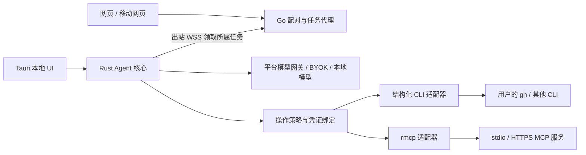

# Lain42 Agent：需求与执行架构规划

日期：2026-09-22。基线：`08100bc`，分支 `agent-ui`。状态：P0-A/P0-B 已有可测试实现，P0-C 已接通网页配对、WSS 桥接和 Radxa headless companion，P0-D 已接通 Tauri 的 MCP stdio/HTTPS 会话和浏览器桥接；本文仍不代表全部功能已经上线。

## 0. 实现进度（2026-09-22）

已落地并通过本地回归的部分：

- Tauri 受控操作运行时：固定操作注册表、参数校验、档案级 `GH_CONFIG_DIR`、清理继承 token、超时、取消、进程树终止和读取期间输出上限。
- 独立 Rust `tauri/agent-session`：结构化 `assistant.tool_calls` 续轮、调用 ID 配对、预算、取消和有界模型响应。
- Agent 网页的桌面桥接：仅在 Tauri 中公开 `github.issues.list`，通过 `cli_exec` 调用本机 `gh`；普通浏览器不会获得本机执行权限。
- Go 配对模型、服务、路由和迁移：一次性配对票据、确认票据、兑换票据、设备撤销和凭证摘要存储。
- 配对设备桥接：桌面凭证认证、同源 WebSocket、按设备归属转发结构化请求/结果，服务端不执行用户 CLI；网页与 Tauri 页面已有桥接客户端和配对入口。
- `tauri/agent-companion`：面向 Radxa A7A 的纯 CLI/headless Linux ARM64 连接器，主动 WSS、固定 `gh` 操作、受限本地 MCP allowlist、服务端心跳、断线退避和同一输出/超时边界；ARM64 workflow 只构建并上传该二进制，不依赖 KDE/WebView；手机和互联网只访问网页/API。
- Agent 工具侧栏已有网页配对入口：创建短时 pairing ticket，Radxa claim 后把 confirmation ticket 粘回网页，确认后再由 Radxa redeem 并启动 companion。
- Tauri `rmcp` 客户端：显式连接 stdio / HTTPS Streamable HTTP、分页发现工具、受限参数与结果、连接/调用超时、断开清理；MCP 调用在本地和配对桌面均要求精确参数确认。
- 配对桥接已允许 `mcp.list` / `mcp.call` 两个固定操作；浏览器只接收已连接工具的 schema，不接收桌面的命令行参数或 bearer token。Tauri 桌面和 Radxa companion 均支持 MCP，但 Radxa 只加载设备管理员明确允许的本地配置，不能由网页动态注入命令或 token。
- Agent bridge 已加入可向后兼容的 v1 握手（协议版本 + 有界 capability list），并发布语言无关的 `docs/lain42-agent-bridge-v1.schema.json`；未来 Lilyco、Android/iOS、WebView 或其他 Rust/Go 客户端只需实现该边界，不需要复制 Go 服务内部实现。
- Lilyco framework 通过 `lilyco --mcp` 作为标准 MCP server 接入；Lain42 依赖 MCP/schema 契约，不依赖 Lilyco 内部 crate，因此 CLI/TUI/Web/MCP 后端可独立升级。

仍未宣称完成的部分：跨页面断线任务恢复、MCP 的真实 stdio/HTTPS 服务互操作回归、写操作的持久审批/防重放与全链路 A1–A11 验收。当前 Tauri 配对凭证和 MCP 连接只保存在本次桌面进程内存，退出后需要重新配对/连接；在引入系统密钥库之前不把它称为持久设备登录。

## 1. 产品目标与首个验收

用户在网页或桌面提出任务，Agent 使用该用户授权的 CLI/MCP 工具，展示执行过程，并依据真实结果继续回答。首个完整场景是“查看我的仓库最近的 Issue”。

- 首发验证环境：Windows 桌面 + Chrome/Edge 网页，以及无 KDE 的 Radxa A7A headless 节点；macOS/Linux 共享运行时并通过各平台验收后开放。
- 网页和 Android/iOS 浏览器可以控制已配对且在线的桌面或 Radxa 节点；移动浏览器负责 UI 和 lain42 网关模型，不在手机上伪装运行本机 CLI。
- 桌面允许不登录 Lain42，使用本地模型或用户自带模型接口；使用平台模型、跨设备配对时需要平台身份。
- 工具凭证不进入模型上下文。用户同意后，必要的工具结果会发送给选定模型；本地执行不等于数据绝不出本机。
- 本轮交付是需求、方案选择、模块契约、实施顺序、验证门槛。实现仍须逐项通过下方验收。

首个场景的明确语义：选择仓库后，默认取该仓库最近更新的 10 条未关闭 Issue，按更新时间倒序，排除 PR；回答包含仓库、筛选条件、标题、编号、链接和获取时间。没有指定仓库时使用用户显式选择的工作区仓库；没有选择则询问或展示仓库列表，不能猜测。“我的全部仓库”必须另行定义分页和扫描范围。

## 2. 当前证据与缺口

| 证据位置（相对仓库根） | 已有能力 | 缺口及影响 |
| --- | --- | --- |
| `web/src/features/agent/index.tsx` | Agent 页面、预设、工具侧栏 | UI 入口不能证明任务执行闭环 |
| `web/src/features/playground/hooks/use-stream-request.ts` | SSE 请求、取消、content/reasoning 更新 | 回调只传文本/思考，没有完整工具调用事件 |
| `web/src/features/playground/lib/streaming/payload-builder.ts` | 构造聊天请求 | 没有工具定义注册和调用结果续轮逻辑 |
| `web/src/features/agent/components/github-cli-card.tsx` | 手动 Tauri GitHub 调用 | 浏览器没有 Tauri invoke；结果不自动进入聊天续轮 |
| `web/src/features/agent/tool-manifest.ts` | CLI/MCP 展示目录 | 没有输入 schema、执行权限与运行时能力协商；静态声明不等于可用 |
| `tauri/src/tool_runtime.rs` | 固定可执行文件目录、结构化 argv | 参数限制仅检查大小/NUL；没有按操作授权、超时、进程树取消 |
| 同文件 `cli_output` / `bounded_text` | 完成后截断返回文本 | `Command.output()` 先收集完整输出；64 KiB 返回上限不限制运行内存 |
| `tauri/src/main.rs` 的 profile 与 `gh_config_dir` | 按环境变量/OS 用户选择 `GH_CONFIG_DIR` | 不等于平台账号隔离；子进程继承的 token 可能覆盖所选档案 |
| `tauri/TOOL_PROTOCOL.md` | v1 CLI/MCP 边界、Tauri 命令与配对转发契约 | 需要真实 stdio/HTTPS 服务和恶意描述回归；写操作审批仍是会话级确认 |

未验证事项：线上部署 SHA、线上模型的 tool-calling 能力、当前安装包实际工具执行。这些不能由仓库静态检查推定。

## 3. 调研与复用决策

检索使用 `gh search repos`：`mcp rust sdk`、`agent desktop mcp`、`mcp browser bridge`；随后通过 `gh api repos/...` 核实官方候选。下列星数与更新时间是本次查询快照，不是选型的唯一依据。

| 候选 | 星数 / 最近 push（UTC） | 许可证证据 | 适配与决定 |
| --- | --- | --- | --- |
| [官方 Rust MCP SDK](https://github.com/modelcontextprotocol/rust-sdk) | 3,945 / 2026-09-18 | LICENSE 说明 Apache-2.0 迁移中，部分历史贡献仍 MIT | 采用其 MCP client/session/transports，不手写 MCP；不能替代产品权限和配对 |
| [Goose](https://github.com/aaif-goose/goose) | 54,529 / 2026-09-21 | API：Apache-2.0 | Rust Agent + MCP 扩展的主要整套候选；参考运行时分层。迁入完整应用会重复现有账号、聊天和计费，暂不整体替换 |
| [GitHub MCP Server](https://github.com/github/github-mcp-server) | 33,099 / 2026-09-16 | API：MIT | 后续无桌面云连接器候选；不能满足首个场景必须由用户本机 gh 驱动的约束 |
| [Vercel AI SDK](https://github.com/vercel/ai) | 26,870 / 2026-09-21 | API 未识别，已找到原始 LICENSE，集成前按锁定版本复核 | JS 编排备选；本轮不同时引入第二套 Rust/JS 编排核心 |

决策：保留现有网站与 Tauri，提取可独立测试的 Rust Agent 核心，采用官方 rmcp 处理 MCP。只自研产品特有的账号/设备配对、操作策略及平台接入。没有证据证明某个完整应用已覆盖“现有账号计费 + 本机 gh + 网页配对 + 多用户隔离”的 80%，不编造覆盖率。

备选 A：整套 Fork Goose，可更快获得通用 Agent，但需要替换/对接现有产品会话体系。备选 B（选择）：在现有产品中组合标准 SDK，新增一个核心执行层，避免再次为每个 CLI 写专用页面和 Tauri 命令。若后续验证发现 rmcp/模型调用适配工作超过预期，重新比较 Goose 核心复用成本，不能凭此文假定已经验证其嵌入 API。

已克隆并阅读官方 Rust SDK，固定 SHA `dbd238275534c3a8da4d91b7220655e878216988`：

- [HTTP client 示例](https://github.com/modelcontextprotocol/rust-sdk/blob/dbd238275534c3a8da4d91b7220655e878216988/examples/clients/src/streamable_http.rs)：有会话初始化、协议版本协商、list_tools、call_tool、取消；证明有可复用实现，不证明本产品已经接通。
- [工具适配器](https://github.com/modelcontextprotocol/rust-sdk/blob/dbd238275534c3a8da4d91b7220655e878216988/examples/simple-chat-client/src/tool.rs)：用同一 Tool trait 包装 MCP 工具。
- 同目录 `chat.rs` 是示例代码，包含从普通文本解析 `Tool:` 及把结果作为 user 消息的简化处理；本产品不照搬，必须使用结构化 tool call 和对应 call id。
- [许可证](https://github.com/modelcontextprotocol/rust-sdk/blob/dbd238275534c3a8da4d91b7220655e878216988/LICENSE)：锁定依赖时保留适用声明。

社区线索：[Browser MCP 作者参与的 HN 讨论](https://news.ycombinator.com/item?id=43613194)提醒桥接应用的可审计性、遥测和授权面容易被忽略；这是讨论线索，不作为其产品是否存在漏洞的结论。技术策略以 [MCP 官方安全文档](https://modelcontextprotocol.io/docs/2025-11-25/tutorials/security/security_best_practices) 为依据：区分客户端与上游授权、防 SSRF、限制本地服务器权限。另据 [gh 环境变量文档](https://cli.github.com/manual/gh_help_environment)，环境 token 优先于存储凭证，故目录隔离不能单独作为验收证据。

## 4. 运行架构与数据边界

- `agent-core`：无 Tauri/React/Go 依赖，持有任务状态机、模型续轮、工具目录、预算、结果关联。桌面和 headless companion 逐步共用。
- `ToolAdapter`：统一 describe/list、invoke、cancel、health；CLI 和 MCP 是适配器，展示目录由运行时发现结果生成。
- Tauri：薄 IPC、系统密钥库、设备注册、本地授权窗口。React：任务与工具调用卡片，不包含命令拼接和执行权限决策。
- Go：沿用平台鉴权与计费；新增设备、授权、任务路由和事件持久化，不在网关宿主机执行用户 CLI。
- 模型请求继续经过现有平台计费链路，不能绕过额度校验；适配器也允许本地模型或用户自己的接口。实际接口路径与流式 tool_calls 保真必须用集成测试验证后确定。
- 网页接入选择“桌面主动连接平台 WSS”的桥接方式，便于跨设备使用。第一版不开放公网或无认证 localhost shell 服务；无配对设备时明确显示不可执行。
- 同一套 Agent 核心只有一个任务所有者；浏览器断开不引入第二个执行循环。桌面不在线时任务显示离线，不伪装执行成功。

## 5. 统一契约（规划 v2，不伪称 MCP 扩展标准）

MCP 协议由 SDK 实现；下面是本产品任务信封，与 MCP 协议版本分开。保留旧 `cli_exec` 的兼容壳，但不得继续作为绕过策略的入口。

| 对象 | 必须字段 / 约束 |
| --- | --- |
| ToolDescriptor | namespaced id、schemaVersion、inputSchema、outputSchema、adapter、read/write 风险、所需能力、来源版本；模型只收到允许使用的工具子集 |
| Run | runId、可信身份绑定、deviceId、workspaceId、model、预算、状态；不能相信模型/浏览器提供的 userId |
| ToolCall | callId、runId、toolId、schemaVersion、参数、deadline；执行端重新校验 schema 和授权 |
| ToolResult | callId、status、structuredContent、boundedText、truncated、来源/获取时间、errorCode；无 token、无进程环境转储 |
| RunEvent | eventId、runId、递增 seq、type、时间、最小必要 payload；重连按游标去重恢复 |
| Approval | 用户、设备、工作区、工具版本、参数摘要、有效期、单次使用；参数变化使批准失效 |

任务状态：queued → planning → waiting_approval / executing → synthesizing → succeeded；任意活动态可进入 failed / cancelling → cancelled，或设备失联进入 interrupted。未知执行结果标记 unknown，不能自动重试写操作。终态不可被迟到事件恢复。

错误码至少包括 auth_required、device_offline、permission_denied、invalid_arguments、tool_unavailable、model_unsupported、timeout、output_limit、cancelled、upstream_error、execution_unknown。

模型循环要求：按 call id/index 聚合流式参数；只在完整调用到达且 schema 校验通过后执行。保留 assistant.tool_calls，把每个结果写成对应 role=tool/tool_call_id，再请求下一轮。多调用逐个记账、禁止未知工具。普通回答中的命令代码块永远只是文本。达到步数/时间/费用上限后明确停止；模型不支持工具时显示原因或让用户换模型，不解析自然语言充当执行协议。

可扩展性：新增工具原则上只新增 manifest/schema 和适配配置；特殊生命周期才新增适配器。显式版本协商、未知可选字段忽略、未知必需能力拒绝；废弃字段留迁移窗口。不要把十年扩展性解释为首版插件市场、任意动态代码加载或全套分布式调度。

## 6. 身份、配对与执行边界

1. 桌面匿名档案与平台账号档案不同。平台账号切换后不能沿用旧账号设备授权/运行历史；凭证绑定为 `(平台用户或匿名档案, device, workspace, provider, account)`，系统密钥库条目也必须区分档案。
2. 网页已登录用户创建短期单次配对会话（建议 5 分钟）；桌面展示网站域名、平台账号、设备名及权限后本地确认。设备密钥存 OS 密钥库，云端存公钥或凭证摘要。配对码不是长期执行凭证。
3. 同源会话接口防 CSRF，WSS 校验 Origin 与账号/设备绑定；轮换、撤销、登出、重复使用、跨账号领取均有测试。设备领取任务时验证签发主体、过期和执行范围；平台管理员不能隐式得到用户本机权限。
4. gh 凭证从当前档案密钥库显式注入子进程；清除继承的 GH_TOKEN/GITHUB_TOKEN/企业 token/调试输出及命令影响环境，固定 host、repo、执行文件与工作目录，避免全局 keychain 回退串号。禁止把 gh auth token 暴露成模型工具。
5. CLI 允许“操作”，不只是“程序名”。例如 github.issues.list 接收 repo/state/limit/sort，受信适配器生成 argv；不能把任意 gh args、扩展、shell、编辑器、模板执行入口直接交给模型。用户安装工具与批准执行分开。
6. 已授权范围内只读任务直接执行；写入需要原生或可信批准页显示目标、变更与账号。批准与确切参数绑定，执行端再次检查；拒绝不能重试绕过。MCP 的 readOnly 等注释是提示，不是安全证明。
7. 建议初始上限：单工具 30 秒、每流 64 KiB、每次任务最多 8 次工具调用、总活动时间 120 秒、同时执行 2 个只读操作。等待人工批准另设有效期。数值是待压测配置，不是已测性能指标。
8. 输出在读取期间计量并限制缓冲；达到限额时终止或安全持续丢弃并标记截断。取消/超时终止整棵进程树（Windows Job Object、Unix process group），并验证无孤儿进程；不能只取消等待 future。
9. 远程 MCP 按用户保存连接与授权，采用 SDK 协议协商、tools/list 分页、tools/call、会话清理。校验目标 URL、重定向和授权元数据，避免 SSRF；服务描述/Issue 内容属于不可信数据，不能更改工具策略。
10. 首版不执行需要交互终端的 yazi 作为普通输出工具；可作为显式“打开本地应用”动作。jj 写入、ast-grep 改写、CodeGraph 扫描都需要工作区范围与独立能力声明。

## 7. 分阶段任务与交付门槛

| 阶段 | 工作包 / 建议模块 | 依赖 | 可交付结果 |
| --- | --- | --- | --- |
| P0-A | 从 `tauri/src/tool_runtime.rs` 提取 `agent-core`；操作 schema、受控环境、超时/取消/输出限制、档案凭证绑定 | 无 | Windows 可测试的执行核心；旧入口也走相同策略 |
| P0-B | 核心模型适配与工具循环；`features/agent` 展示执行卡片、停止、错误、证据链接 | P0-A | 桌面一句话读取指定仓库 Issue 并基于结果总结 |
| P0-C | Go `agent` 路由/服务/模型与迁移；设备配对、WSS、任务事件；桌面连接器 | P0-A 契约 | 普通浏览器通过配对电脑完成同一个场景 |
| P0-D | rmcp stdio/HTTPS 适配、用户连接设置、会话级参数确认与执行去重 | P0-A 契约 | CLI/MCP 共用聊天循环；批准/拒绝均有可见结果；桥接浏览器只拿工具描述 |
| P0-E | 全链路验收与故障恢复 | B/C/D | 网页、桌面、双用户隔离和恶意工具结果均通过，才称“可用 Agent” |
| P1 | PR/仓库搜索、jj/ast-grep/CodeGraph、完整移动布局、三平台发布、更多本地模型 | P0 | 新增工具无需为每个工具改聊天引擎和页面 |
| P2 | 托管连接器、团队设备、任务调度、商业套餐、用量/成本分析 | P1 + 实际使用数据 | 有明确付费价值与权限边界 |
| P3 | 插件市场、自动邮件/QQ/微信/Telegram、大规模后台自动化 | 需求与官方接入证据 | 单独规划，不提前承诺第三方自动化能力 |

按模块分工而非同时改一个大文件：核心执行、网页任务 UI、云配对服务、验收四个职责；先固定契约再并行，集成由核心负责人负责。此规划不自行启动子代理。估算仅供排序：P0 为约 12–20 人日（含三个平台进程与凭证差异验证），是待首个闭环校准的工程估计，不是交付承诺。

## 8. 验收矩阵：全部必须有证据

| ID | 场景 | 必须看到的证据 |
| --- | --- | --- |
| A1 | 桌面“查看仓库最近 Issue” | 真实 gh 子进程、确定筛选/排序、tool_call_id 对应结果、最终链接与事实一致；零结果也正确 |
| A2 | 普通网页同一句话 | 无 Tauri 全局对象，配对后工具在指定电脑执行，网页展示进度与结果；离线有明确提示 |
| A3 | 两用户/同机两个档案 | A 不能枚举/执行 B 的设备、凭证、历史；环境预置另一账号 token 也不串号，切换/撤销立即生效 |
| A4 | 长输出/挂起/取消 | 内存不随无限输出增长、达到限额可解释、期限内终止且无孤儿进程；重连不重复执行 |
| A5 | 写操作批准 | 当前 MCP/本地循环已做到每次精确参数确认；仍需在一次性测试仓库验证持久审批、批准一次只执行一次、篡改参数/重放失败 |
| A6 | MCP 两种传输 | 适配器已支持 stdio 与 Streamable HTTP；仍需用官方测试服务完成 list/call/断线/取消，验证错误与 schema 不兼容可解释 |
| A7 | 模型协议 | 分片 JSON、多 tool_calls、无效参数、不支持工具、超轮数、429/中断均确定收敛，不能执行半包 |
| A8 | 恶意 Issue / MCP 描述 | 内容诱导读取凭证/越权工具时被运行时拒绝；日志、模型请求和网页无 token |
| A9 | 本地免登录 / 移动使用 | 本地模型+本地工具不依赖 Lain42 登录；Android 网页能控制已配对设备，后台中断可恢复状态 |
| A10 | 扩展证明 | 增加第二个 CLI 和一个 MCP 服务，只改适配配置/实现，不改模型循环及主聊天组件 |
| A11 | 网关与商业边界 | 真实平台账号请求经过现有用量/限额链路；禁止重复计费和泄露其他用户会话；上游失败被正确记录 |

测试分层：核心用受控子进程与模拟模型做确定性回归；MCP 使用官方 SDK 测试服务；平台隔离用两个测试账号；最后运行真实 gh 和实际支持工具的模型，记录脱敏 runId、版本、事件和截图。模拟通过不能替代 A1/A2 的真实执行。

## 9. 发布与回退

新功能用独立 Agent 开关与协议版本协商灰度。旧聊天仍可用；不支持版本的桌面明确要求更新。数据库迁移可增量部署，SQLite/MySQL/PostgreSQL 分别验证。回退停止新任务、撤销桥接授权、保留脱敏审计；不把执行中的写操作重新入队。Agent 运行时产物与网页发布版本分别记录，使用 GitHub Actions 构建，但构建成功不等于工具闭环验收成功。

商业验收先看任务完成率、首次接入成功率、每次成功任务模型成本和故障率；目标值在内测建立基线后确定。首个价值是“真能处理开发工作”，不是安装包数量或工具目录长度。

下一步唯一实施起点：P0-E。先用官方 MCP 测试服务和真实 `gh` 完成 A1/A2/A4/A6/A7 的脱敏证据，再补持久审批、防重放和断线任务恢复；在这些证据齐全前不把 Agent 宣称为全链路完成。
